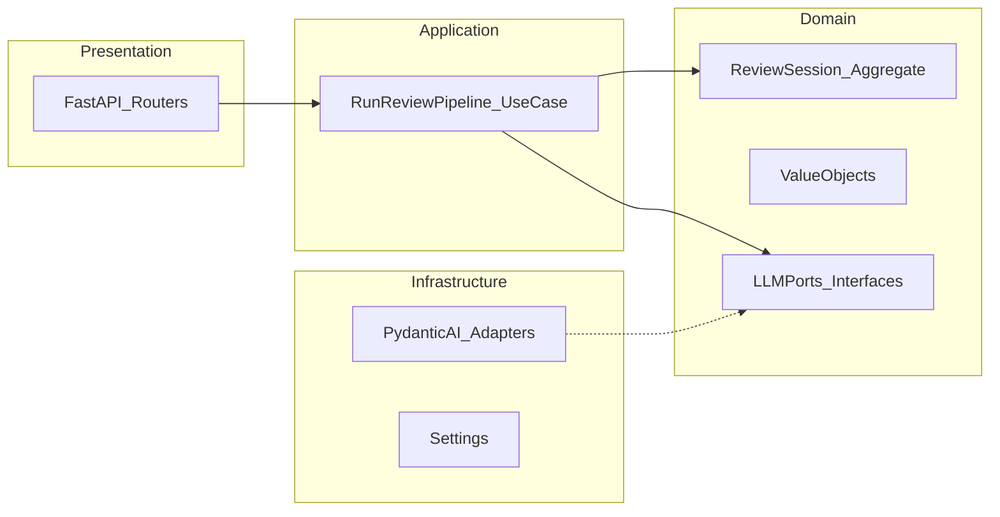
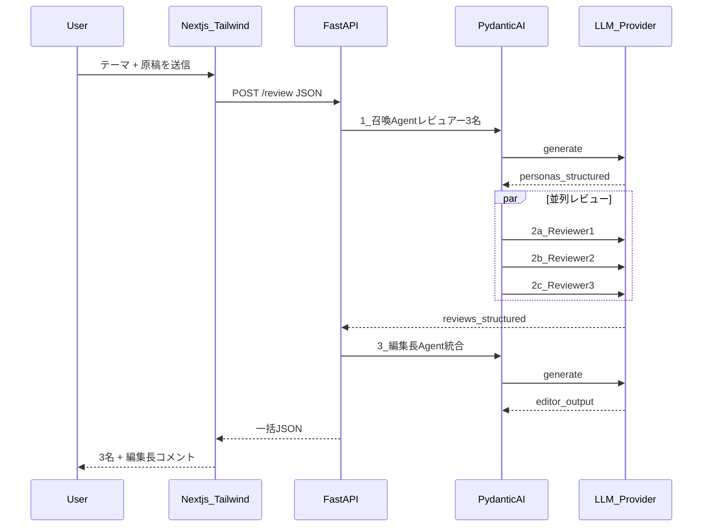

# 技術ブログ/LT用「レビュアー召喚」Webエージェント（改訂版）

## 開発の進め方（全体ゲート）

次の**文書4点をこの順で作成・合意**してから実装に入る。実装は **TDD（テストファースト）** と **DDD（境界づけられたコンテキストと層分離）** に従う。

| 順序 | 成果物 | 置き場（案） | 主な内容 |
|------|--------|----------------|----------|
| 1 | **要求定義書** | [docs/requirements.md](docs/requirements.md) | 目的、スコープ外、ユーザーストーリー、入力制約、品質/セキュリティ要求、用語集 |
| 2 | **機能設計書** | [docs/functional-design.md](docs/functional-design.md) | 画面項目、API（リクエスト/レスポンス）、エラー一覧、ユーザーフロー、要求IDへのトレース |
| 3 | **技術設計書** | [docs/technical-design.md](docs/technical-design.md) | アーキテクチャ、DDDマッピング、ディレクトリ、シーケンス、環境変数、拡張ポイント |
| 4 | **テスト計画書** | [docs/test-plan.md](docs/test-plan.md) | テストレベル（単体/結合/E2Eの扱い）、優先度、モック方針、完了基準 |

各ドキュメントの末尾に**次工程への入力チェックリスト**（例: 機能設計が要求の全ユースケースをカバーしているか）を置くとレビューしやすい。

**注**: ワークスペースの AI-DLC 用 `aidlc-docs/` は本プロジェクトでは使わず、上記 **`docs/`** に一本化する（ユーザー明示の成果物と重複させない）。

## 前提（ユーザー確定事項）

- **UI**: [Next.js](https://nextjs.org/)（App Router）+ **Tailwind CSS**。
- **バックエンド**: [FastAPI](https://fastapi.tiangolo.com/) + [PydanticAI](https://ai.pydantic.dev/) で LLM 呼び出しと構造化出力を実装。
- **実行環境**: まずは**ローカルPC**で動けばよい（同一マシンでフロント・APIの2プロセス）。
- **入力**: テーマに加え、**原稿・構成メモ・スライド要約**などレビュー対象テキスト。
- **パイプライン**: **3人のレビュアー**による多視点レビュー → 最後に**編集長エージェント**が**統合コメント**（全体方針・優先修正・重複整理）を出力。

## DDD に沿ったバックエンド構成（技術設計書で詳細化）

概念モデルは技術設計書に図示する。実装時の**目安**は次のとおり。

- **domain**: 集約（例: `ReviewSession`）、値オブジェクト（テーマ・原稿の長さ制約など）、**LLM へのポート**（インターフェースのみ）。外部I/Oなし。
- **application**: ユースケースが「召喚 → 3並列レビュー → 編集長」の順序とトランザクション境界（失敗時の扱い）を組み立てる。
- **infrastructure**: PydanticAI の Agent 実装がポートを満たす。設定・HTTPクライアントはここ。
- **presentation**: FastAPI は DTO の変換と HTTP ステータスのみに薄く保つ。

フロントはDDDの**別コンテキスト**（表示・入力検証のUIルール）として設計書に短く記載する。

## TDD の進め方

1. **テスト計画書**で「単体の対象」（domain / application）と「結合の対象」（FastAPI + スタブLLM）を先に定義する。
2. **Red**: `pytest` で期待レスポンスまたはドメイン結果を書く（最初は失敗）。
3. **Green**: 最小実装でパス。
4. **Refactor**: 層の依存方向を崩さない範囲で整理。
5. LLM 実呼び出しは **CI ではオプション**、ローカルまたはマーク付き結合テストに寄せる（テスト計画書で方針固定）。

PydanticAI は **infrastructure** に置き、application のテストでは **フェイク実装**（固定JSONを返すポート）で回す。

## アーキテクチャ（リマインダ）

- **APIキー**は FastAPI 側のみ。CORS でローカル Next を許可。

## 体験フロー（ビジネスロジック）

1. **召喚**: テーマと原稿を入力とし、重複の少ない3視点のレビュアー（表示名・専門軸・観点）を構造化生成。
2. **三連レビュー**: 各ペルソナで**同一原稿**を `asyncio.gather` 等で**並列**レビュー。出力は Pydantic モデルで固定（例: 良い点 / 指摘 / 具体修正案）。
3. **編集長**: 原稿・テーマ・3名の構造化レビューを入力に統合。**統合コメント**と**優先修正**、指摘のマージ・矛盾の解消。幻覚抑制をプロンプトに含める。

## 推奨スタック

| 層 | 採用 |
|----|------|
| フロント | Next.js App Router、TypeScript、Tailwind CSS |
| API | FastAPI、Uvicorn |
| LLM層 | PydanticAI（infrastructure） |
| テスト | pytest、httpx（API結合）、必要なら pytest-asyncio |

## ディレクトリ構成（案・技術設計書で確定）

- `docs/` — 上記4文書。
- `backend/`
  - `pyproject.toml`
  - `src/review_summoning/`（パッケージ名は技術設計で確定）
    - `domain/`
    - `application/`
    - `infrastructure/`（PydanticAI）
    - `presentation/`（FastAPI）
  - `tests/` — 鏡像構成で TDD
  - `.env.example`
- `web/` — Next.js + Tailwind、`.env.local.example`

ルート `README.md` に文書一覧・起動手順・TDD実行コマンドを記載。

## UI/UX（最小）

- 送信中の段階表示、編集長ブロックの強調表示（機能設計書でワイヤを固定）。

## 非機能・リスク

- LLM 往復回数・レイテンシ・長文原稿の扱いは要求/技術設計に記載し、テスト計画で回帰対象を定義。

## AI-DLCワークフローについて

本件の公式イテレーションは **`docs/` の4文書 + TDD/DDD 実装** とする。`aidlc-docs/` は作成しない（別ワークフローとの二重管理を避ける）。
