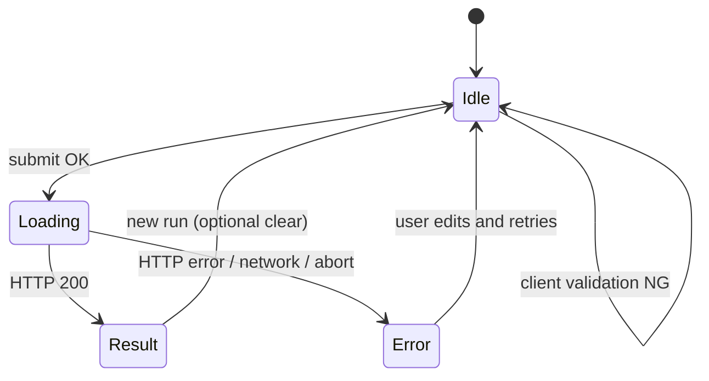

# 機能設計書 — レビュアー召喚 Web

| 項目 | 内容 |
|------|------|
| 文書ID | FUN-2026-001 |
| 版 | 1.0 |
| 根拠文書 | REQ-2026-001（[requirements.md](./requirements.md)） |
| 対象 API（初版） | `POST /api/v1/review`（JSON）。要求書の `POST /review` は本書でパス確定 |

---

## 1. 目的・範囲

本書は要求定義書の機能・非機能要求を、**画面項目**、**HTTP API 入出力**、**状態遷移**、**例外・エラー**、**要求 ID トレース**に落とし込む。技術設計書（DDD 層・モジュール・シーケンス詳細）は本書の入力とする。

---

## 2. 要求トレース一覧

| REQ-ID | 本書での扱い（章） |
|--------|-------------------|
| REQ-F-001 | §4 画面、§6.1 リクエスト |
| REQ-F-002 | §5.2 `reviewers[]`、§7 召喚完了 |
| REQ-F-003 | §5.2 `reviews[]`、§7 |
| REQ-F-004 | §5.2 `editor`、§4 編集長ブロック |
| REQ-F-005 | §4 ワイヤ、§7 状態遷移 |
| REQ-F-006 | §6 API 全体 |
| REQ-NF-001, REQ-NF-021 | §6.4 CORS（要求レベル記載、閾値は技術設計） |
| REQ-NF-002 | §1（ローカル前提） |
| REQ-NF-010〜012 | §6.3 タイムアウト、§8 エラー一覧 |
| REQ-NF-020, REQ-NF-022 | §6.4（キー・非永続化は技術設計で実装） |
| REQ-NF-030, REQ-NF-031 | §5.1 入力上限、§6.2 備考（並列はサーバ実装） |

| UC-ID | 本書での扱い |
|-------|----------------|
| UC-01 | §3.1、§7 |
| UC-02 | §4、§7 `Loading` |
| UC-03 | §8 |

| US-ID | 対応 REQ（要求書より） | 本書 |
|-------|------------------------|------|
| US-01〜05 | REQ-F-xxx, REQ-NF-001 | 上表および §4〜§6 |

---

## 3. ユーザーフロー

### 3.1 UC-01 レビュー依頼（主シナリオ）

1. ユーザーがトップ画面でテーマ・レビュー対象テキスト（§5.1）を入力する。
2. フロントがクライアント検証（§5.1）に合格したら「レビュー実行」ボタンを有効化する。
3. ユーザーがボタンを押す → 状態 `Loading`（§7）。
4. フロントが `POST /api/v1/review` を呼び出す。
5. バックエンドが召喚 → 3 名並列レビュー → 編集長の順で処理し、**一括 JSON** を返す。
6. 成功時、状態 `Result`。**3 名のカード**と**編集長ブロック（強調）**を表示する（§4）。

### 3.2 UC-02 進行状況

- 初版は**単一 HTTP 応答**のため、サーバーからの真の段階イベントは送らない。
- `Loading` 中は §4 の**パイプライン段階インジケータ**により、ユーザーが召喚・三連レビュー・編集長の流れを認識できること。
- 応答受信後、段階インジケータはすべて**完了**表示に更新する。

### 3.3 UC-03 失敗時

- §8 の区分に従い、トーストまたはインラインでメッセージを表示する。
- 入力不備は送信前に可能な限り防ぎ、残りは 422 の本文を利用する。

---

## 4. UI 仕様（最小）・ワイヤ

### 4.1 画面構成（単一ページ）

- **ヘッダ**: アプリ名「レビュアー召喚」。
- **入力エリア**: テーマ（1 行）、原稿本文・構成メモ・スライド要約（複数行テキストエリア）、「レビュー実行」ボタン、入力エラー表示域。
- **進行エリア**（`Loading` 時表示）: 段階インジケータ + 全体スピナー + キャンセルなし（初版）。
- **結果エリア**（`Result` 時表示）: レビュアー 3 名のサマリ行 + 各レビューカード + **編集長ブロック**。

### 4.2 ASCII ワイヤ（デスクトップ想定・ローカル）

```
+------------------------------------------------------------------+
| レビュアー召喚                                                     |
+------------------------------------------------------------------+
| テーマ [_________________________________________________]        |
|                                                                   |
| 原稿本文                                                          |
| [.............................................................]   |
|                                                                   |
| 構成メモ（任意）    スライド要約（任意）                            |
| [...........................]  [...........................]      |
|                                                                   |
| [ レビュー実行 ]     (エラーメッセージ表示域)                       |
+------------------------------------------------------------------+
| Loading 時:                                                       |
|  ( ) 召喚  ->  ( ) 3名レビュー  ->  ( ) 編集長統合   [ spinner ]   |
+------------------------------------------------------------------+
| Result 時:                                                        |
|  [R1: 表示名] [R2: 表示名] [R3: 表示名]  （専門軸・観点はカード内） |
| +----------------+ +----------------+ +----------------+           |
| | レビュー1      | | レビュー2      | | レビュー3      |           |
| | 良い点/指摘…  | | ...            | | ...            |           |
| +----------------+ +----------------+ +----------------+           |
| +================================================================+|
| || 編集長の統合（背景色・左ボーダーで強調）                         ||
| || 統合コメント / 優先修正 / 整理メモ                             ||
| +================================================================+|
+------------------------------------------------------------------+
```

### 4.3 編集長ブロックの強調（初版固定）

- 結果エリアの**最下部**にフル幅で配置する。
- **視覚差**: 背景色をレビューカードより一段濃い／またはブランド系の薄色塗り。**左ボーダー 4px** のアクセントカラー。
- 見出し文言固定: 「編集長の統合」。

### 4.4 段階インジケータ（REQ-F-005 / UC-02）

- ラベル固定（順）: `召喚` → `3名レビュー` → `編集長統合`。
- `Loading` 中: 3 ラベルを横並び。いずれか 1 つを「実行中」スタイル（太字 + アイコン）とし、**経過時間に応じて順番にハイライトを移す**（クライアント側演出。サーバー内部フェーズと一致しない場合がある）。
- 応答受信後: 3 つすべて「完了」チェック表示に更新してから結果本文を表示する。

### 4.5 アクセシビリティ（最小）

- ボタン・主要見出しに連続した見出しレベルまたは `aria-label` を付与する（実装は技術設計に委譲）。
- エラーは `role="alert"` 等でスクリーンリーダーに通知可能にする。

---

## 5. データ項目定義

### 5.1 入力（画面 ↔ API 共通セマンティクス）

| 項目 ID | 画面ラベル | API フィールド名 | 必須 | 制約（初版確定） |
|---------|------------|------------------|------|------------------|
| IN-THEME | テーマ | `theme` | 必須 | 前後空白トリム後、**1〜2000 文字**（Unicode スカラ単位でカウント）。空は不可。 |
| IN-DRAFT | 原稿本文 | `draft_body` | 条件付き | 任意単体。トリム後の文字数 **0〜100000**。 |
| IN-MEMO | 構成メモ | `structure_memo` | 条件付き | 同上 |
| IN-SLIDES | スライド要約 | `slides_summary` | 条件付き | 同上 |

**必須組合せ（REQ 7 章の確定）**: `draft_body`・`structure_memo`・`slides_summary` のうち、**少なくとも 1 つ**がトリム後**非空**であること。さもなければクライアント・サーバーとも 422 とする。

**合計サイズ**: `theme` + 3 ブロックのトリム後文字数合計が **200000 文字**を超える場合は 422（サーバー主検証。クライアントは可能なら事前警告）。

### 5.2 出力（API レスポンス・画面表示）

#### 5.2.1 レビュアー（召喚結果）`reviewers[]`（長さ 3 固定を期待）

| フィールド | 型（論理） | 説明 |
|------------|------------|------|
| `id` | string | クライアント側キー用。UUID 形式推奨。 |
| `display_name` | string | 表示名。1〜80 文字。 |
| `specialty_axis` | string | 専門軸。1〜200 文字。 |
| `perspective` | string | 観点。1〜500 文字。 |

#### 5.2.2 レビュー `reviews[]`（要素数 3、`reviewers` と順序対応または `reviewer_id` で対応）

| フィールド | 型（論理） | 説明 |
|------------|------------|------|
| `reviewer_id` | string | `reviewers[].id` への参照。 |
| `good_points` | string[] | 良い点。0 件以上。各要素 1〜1000 文字。 |
| `issues` | string[] | 指摘。各要素 1〜1000 文字。 |
| `concrete_fixes` | string[] | 具体修正案。各要素 1〜2000 文字。 |

#### 5.2.3 編集長 `editor`

| フィールド | 型（論理） | 説明 |
|------------|------------|------|
| `integrated_comment` | string | 全体向け統合コメント。1〜8000 文字。 |
| `priority_fixes` | object[] | 優先修正。`rank`（int 昇順）、`summary`（string）、`related_reviewer_ids`（string[] 任意）。 |
| `deduplication_notes` | string | 重複整理・矛盾解消の説明。0〜4000 文字（空可）。 |

#### 5.2.4 メタ `meta`

| フィールド | 型 | 説明 |
|------------|-----|------|
| `request_id` | string | 相関 ID。UUID。 |
| `completed_at` | string | ISO 8601（UTC 推奨）。 |

---

## 6. HTTP API

### 6.1 `POST /api/v1/review`

- **目的**: 1 リクエストで召喚・三連レビュー・編集長まで完走し、構造化 JSON を返す。
- **Content-Type**: `application/json`
- **認証（初版）**: なし（ローカル）。API キーはサーバ環境変数のみ（REQ-NF-020）。

#### 6.1.1 リクエストボディ

```json
{
  "theme": "string",
  "draft_body": "string | null",
  "structure_memo": "string | null",
  "slides_summary": "string | null"
}
```

- `null` 省略可の実装を許容するが、意味は「未入力」とする。

#### 6.1.2 レスポンス 200 ボディ

```json
{
  "reviewers": [
    {
      "id": "uuid",
      "display_name": "string",
      "specialty_axis": "string",
      "perspective": "string"
    }
  ],
  "reviews": [
    {
      "reviewer_id": "uuid",
      "good_points": ["string"],
      "issues": ["string"],
      "concrete_fixes": ["string"]
    }
  ],
  "editor": {
    "integrated_comment": "string",
    "priority_fixes": [
      {
        "rank": 1,
        "summary": "string",
        "related_reviewer_ids": ["uuid"]
      }
    ],
    "deduplication_notes": "string"
  },
  "meta": {
    "request_id": "uuid",
    "completed_at": "2026-05-12T12:00:00Z"
  }
}
```

**整合性ルール**:

- `reviewers.length === 3`。
- `reviews.length === 3`。
- 各 `reviews[].reviewer_id` は `reviewers[].id` のいずれかと一致。
- `priority_fixes[].rank` はユニークな正整数。

#### 6.1.3 クライアント検証と API 検証の役割分担

- フロント: 必須・文字数・「少なくとも 1 ブロック非空」を検証し、失敗時は**送信せず**インライン表示。
- バックエンド: 同一ルールを再検証（改ざん防止）。不一致は 422。

### 6.2 同時実行・パイプライン順序（要求との対応）

- 召喚 → 3 名**並列**レビュー → 編集長、の順序はサーバ側ビジネスルール（REQ-F-002〜004、REQ-NF-031）。
- 本 API は完了時のみ 200 を返す（部分結果のストリーミングはスコープ外）。

### 6.3 タイムアウト

| 種別 | 推奨値（初版・技術設計で実装確定） |
|------|--------------------------------------|
| クライアント（fetch） | **180 秒** |
| サーバ（LLM 呼び出し全体の上限） | **170 秒**（クライアントより短くし切れを先に検出） |

- タイムアウト時は **504**（ゲートウェイ／サーバがタイムアウトを表す場合）または **503** + 本文 `error.code`（§8）。どちらを採用するかは技術設計で HTTP 層と揃える。

### 6.4 CORS・シークレット（要求トレース）

- 許可オリジン: 開発時は `http://localhost:3000`（Next 既定）を主対象。追加ポートは `.env` で列挙（技術設計・README）。
- キー・原稿の取り扱い: REQ-NF-020, REQ-NF-022 に従い実装（本書は振る舞いのみ）。

---

## 7. 画面・クライアント状態遷移

| 状態 ID | 説明 | 遷移トリガー |
|---------|------|----------------|
| `Idle` | 初期・編集可能 | 初回表示、結果表示後の再実行準備（フォームクリアは任意） |
| `Loading` | API 呼び出し中 | 「レビュー実行」クリックかつクライアント検証 OK |
| `Result` | 結果表示 | API 200 |
| `Error` | エラー表示 | API 4xx/5xx またはネットワークエラー |

遷移図（Mermaid）:



---

## 8. エラー一覧・ユーザー表示

### 8.1 HTTP ステータスと `error` ボディ（推奨共通形）

エラー時は可能な限り次の JSON 形とする（フィールド名は技術設計でコードに固定）。

```json
{
  "error": {
    "code": "VALIDATION_ERROR",
    "message": "人が読める日本語メッセージ",
    "details": [
      { "field": "theme", "issue": "EMPTY" }
    ]
  }
}
```

`details` は省略可。

### 8.2 コード一覧（初版）

| HTTP | `error.code` | 発生条件 | ユーザー向け表示（例） |
|------|----------------|----------|-------------------------|
| 422 | `VALIDATION_ERROR` | テーマ空、長さ超過、ブロック全非空違反、合計超過 | メッセージ + 該当フィールドにインライン |
| 422 | `UNSUPPORTED_MEDIA_TYPE` | Content-Type が JSON でない | 「JSON で送信してください」 |
| 429 | `RATE_LIMITED` | （将来）レート制限 | 「しばらく待って再試行」 |
| 502 | `LLM_UPSTREAM_ERROR` | LLM プロバイダ 4xx/5xx・無効レスポンス | 「AI 側でエラーが発生しました。時間をおいて再試行」 |
| 503 | `LLM_UNAVAILABLE` | 接続不可・一時障害 | 「一時的に利用できません」 |
| 504 | `REQUEST_TIMEOUT` | サーバ処理タイムアウト | 「処理がタイムアウトしました。原文を短くするか再試行」 |
| 500 | `INTERNAL_ERROR` | 想定外例外 | 「内部エラーです。ログを確認してください」 |

### 8.3 フロント専用（HTTP 未到達）

| 状況 | 表示方針 |
|------|----------|
| ネットワーク切断 | 「ネットワークに接続できませんでした」 |
| クライアントタイムアウト | 504 と同様の文言 |
| CORS 失敗（開発時） | 「API に接続できません（CORS 設定を確認）」※開発者向けニュアンス可 |

---

## 9. オープン課題（技術設計書へ引き渡し）

- Pydantic モデル名・パッケージ配置・ポート I/F へのマッピング。
- LLM プロンプト文言・幻覚抑制の具体文（要求 6.1.3）。
- タイムアウトを Uvicorn／ミドルウェアのどこで適用するか。
- `priority_fixes` の最大件数上限（例: 20 件）の要否。

---

## 10. 次工程（技術設計書）への入力チェックリスト

- [ ] 本書の `POST /api/v1/review` が OpenAPI／Pydantic モデルに写像できる
- [ ] DDD のコンテキスト境界（UI コンテキスト vs コアドメイン）が説明できる
- [ ] タイムアウト・CORS・環境変数が技術設計に数値・列挙で記載される
- [ ] LLM 往復シーケンス（召喚・並列 3・編集長）がシーケンス図で追える
- [ ] 単体テスト可能なドメインルール（§5.1, §6.1.2 整合性）が列挙される

---

## 改訂履歴

| 版 | 日付 | 変更内容 |
|----|------|----------|
| 1.0 | 2026-05-12 | 初版（計画・要求定義に基づく） |
