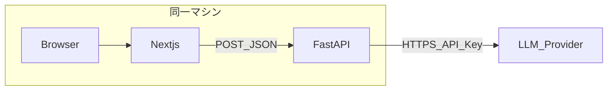
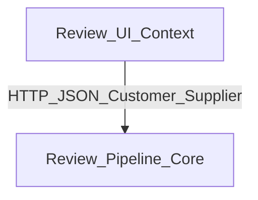
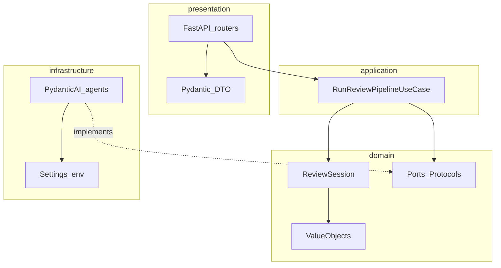
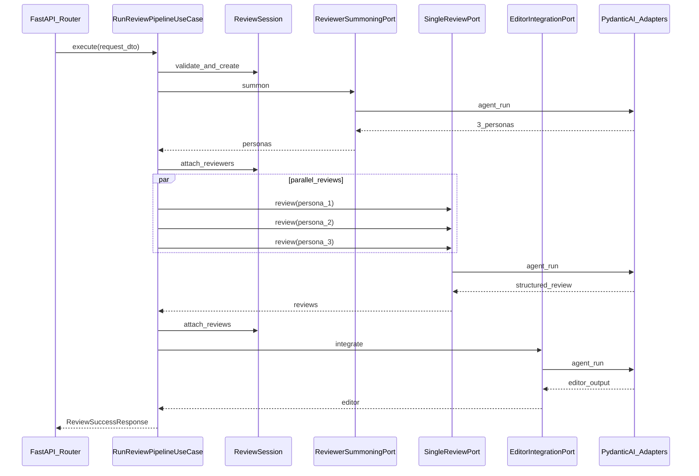

# 技術設計書 — レビュアー召喚 Web

| 項目 | 内容 |
|------|------|
| 文書ID | TEC-2026-001 |
| 版 | 1.0 |
| 根拠文書 | FUN-2026-001（[functional-design.md](./functional-design.md)）、REQ-2026-001（[requirements.md](./requirements.md)） |
| 実装スタック | Next.js（App Router）+ TypeScript + Tailwind、FastAPI + PydanticAI、Uvicorn |

---

## 1. 目的・範囲

本書は機能設計書で確定した **HTTP 契約**、**入力検証ルール**、**エラー区分**を、**DDD の境界づけられたコンテキスト**、**層構成**、**モジュール境界**、**実行時設定**、**シーケンス**に写像する。テストレベル・モック方針の詳細は [test-plan.md](./test-plan.md)（別紙）で扱う。

**スコープ外（本書で深入りしない）**: 具体的プロンプト全文（幻覚抑制の文言はインフラ層の設定方針のみ記載）、CI パイプラインの YAML 全体。

---

## 2. 要求・機能設計へのトレース

| 根拠 | 本書での主な所在 |
|------|------------------|
| REQ-F-002〜004, REQ-NF-031 | §4.3 ユースケース、§6.2 並列方針 |
| REQ-F-006, FUN §6 | §5 API／DTO 写像、§7 presentation |
| REQ-NF-001, REQ-NF-020〜022 | §8 セキュリティ・CORS・シークレット |
| REQ-NF-010〜012, REQ-NF-030 | §9 タイムアウト・長文方針 |
| REQ-NF-040, REQ-NF-041 | §10 環境変数、§11 ランタイム推奨版 |
| FUN §9 オープン課題 | §4.4 ポート I/F、§6.3 Pydantic モデル名、§9.2 タイムアウト適用箇所、§5.2 `priority_fixes` 上限 |

---

## 3. システム文脈



- フロントは **ブラウザのみ** API キーを保持しない。
- バックエンドが **単一エンドポイント**でパイプラインを完走し、一括 JSON を返す（FUN §6.2）。

---

## 4. DDD：境界づけられたコンテキスト

### 4.1 コンテキスト一覧

| コンテキスト | 責務 | 実装の置き場 |
|--------------|------|----------------|
| **レビュー・パイプライン（コア）** | 召喚 → 3 名並列レビュー → 編集長の順序、ドメイン不変条件、LLM への依存の抽象化 | `backend/src/review_summoning/` の `domain` / `application` / `infrastructure` / `presentation` |
| **レビュー UI（別コンテキスト）** | 入力のクライアント検証、ローディング演出、結果レイアウト、HTTP クライアント | `web/`（Next.js） |

**統合方式**: UI コンテキストはコアの **公開 HTTP 契約（OpenAPI 相当の JSON）** のみに依存し、ドメインモデルを共有 import しない（型は双方で独立定義し、機能設計のフィールド名で一致させる）。

### 4.2 コンテキストマップ（要約）



---

### 4.3 コア：ユースケース（アプリケーション層）

**ユースケース名**: `RunReviewPipeline`（仮称、実装クラス名は `RunReviewPipelineUseCase` 等でよい）。

1. **入力 DTO**（presentation から渡す、または application 専用のコマンド型）に対し、ドメインの入力検証を実行する（FUN §5.1 および本書 §5.3 の二段階検証に従う）。
2. **召喚**: `ReviewerSummoningPort.summon(...)` → `ReviewSession` にレビュアー 3 名を反映。
3. **三連レビュー**: 3 つの `SingleReviewPort.review(...)` を **`asyncio.gather`** で並列実行。各呼び出しに **個別のキャンセル用タイムアウト**（§9）を課すか、全体バジェットでラップする（§9.2）。
4. **編集長**: `EditorIntegrationPort.integrate(...)` を召喚・レビュー結果が揃った後に **1 回**実行。
5. **出力**: 機能設計 §6.1.2 整合性を満たす **レスポンス DTO** を組み立てる。

失敗時は例外を **ドメイン／アプリケーション例外** に正規化し、presentation で HTTP + `error.code` に写像する（FUN §8）。

---

### 4.4 ドメイン層

#### 4.4.1 集約

| 集約（仮） | 責務 | 不変条件（例） |
|------------|------|----------------|
| `ReviewSession` | 1 リクエスト単位のライフサイクル。レビュアー・各レビュー・編集長出力の整合 | `reviewers` が 3 名確定後にのみ並列レビュー開始。`reviews` は各 `reviewer_id` が既存 ID。編集長は 3 レビュー完了後のみ |

集約ルートは **外部 I/O を持たない**。LLM 呼び出しはすべて **ポート** 経由。

#### 4.4.2 値オブジェクト（例）

| VO 名（仮） | 内容 |
|-------------|------|
| `Theme` | 1〜2000 文字、トリム後非空 |
| `ManuscriptBundle` | `draft_body` / `structure_memo` / `slides_summary` のトリム済み文字列。少なくとも 1 ブロック非空。合計 200000 文字以下 |
| `ReviewerId` | UUID 文字列 |
| `RequestId` | 相関用 UUID |

フィールド長の数値は FUN §5.1 に従い、**ドメインのファクトリ／コンストラクタ**で検証する。

#### 4.4.3 ポート（インターフェース）— `domain/ports/`（案）

ドメインは **戻り値をドメイン型またはシンプルなデータクラス** とし、Pydantic の `BaseModel` に依存しない（テスト容易性）。必要なら application 境界で Pydantic に変換。

| ポート名（仮） | メソッド概要 | 備考 |
|----------------|--------------|------|
| `ReviewerSummoningPort` | `async summon(theme, manuscript_text_for_llm) -> tuple[ReviewerPersona, ...]`（長さ 3） | 「原稿＋任意メモ」を 1 テキストブロックに連結する方針は application で決め、VO は変更不要なら省略可 |
| `SingleReviewPort` | `async review(persona, manuscript_text_for_llm) -> StructuredReview` | 3 回並列で呼ぶ |
| `EditorIntegrationPort` | `async integrate(theme, manuscript, reviews) -> EditorOutput` | 1 回 |

**代替案**: 上記 3 ポートを `LLMReviewClient` の 1 インターフェースにまとめる。初版は **3 メソッドに分割**しテストダブルを小さく保つことを推奨。

---

## 5. API・DTO のコード写像

### 5.1 HTTP

| 項目 | 値 |
|------|-----|
| メソッド・パス | `POST /api/v1/review` |
| 成功 | `200` + FUN §6.1.2 ボディ |
| 入力不備 | `422` + `error.code = VALIDATION_ERROR` |
| LLM 失敗 | `502` / `503`（FUN §8.2） |
| **サーバ処理タイムアウト** | **`504`** + `error.code = REQUEST_TIMEOUT`（機能設計 §6.3 の「技術設計で揃える」に合わせ、**ゲートウェイ的な切れ**を 504 で表現） |

### 5.2 レスポンス制約の追加（オープン課題の確定）

| 項目 | 初版の実装方針 |
|------|----------------|
| `priority_fixes` | 最大 **20 件**。超過分は編集長プロンプト側で抑制するか、受信後にトリム（ログに警告）。**推奨はプロンプトで 20 件以内を明示** |
| `good_points` / `issues` / `concrete_fixes` | 各配列最大 **50 要素**（異常に長い配列によるメモリ圧迫を防ぐ）。超過時は 502 ではなくサーバで切り詰め |

### 5.3 Pydantic モデル（presentation／application 境界）

**配置**: `review_summoning.presentation.schemas`（モジュール名は実装時に `schemas` または `dto` で統一）。

| モデル名（案） | 用途 |
|----------------|------|
| `ReviewRequestBody` | リクエスト JSON。フィールド: `theme`, `draft_body`, `structure_memo`, `slides_summary`（Optional/nullable） |
| `ReviewerOut` | `reviewers[]` の要素 |
| `ReviewItemOut` | `reviews[]` の要素 |
| `EditorOut` | `editor` |
| `MetaOut` | `meta` |
| `ReviewSuccessResponse` | 上記を束ねた 200 レスポンス |
| `ErrorBody` / `ErrorEnvelope` | FUN §8.1 |

バリデーションは **二段階**が望ましい:

1. Pydantic で型・文字数レンジ（FUN §5.1）。
2. ドメイン VO で「少なくとも 1 ブロック非空」「合計 200000」など **意味的制約**（重複してもよいが、application はドメイン検証を必ず通す）。

---

## 6. レイヤ構成と依存方向

### 6.1 層図



**依存ルール**:

- `domain` → 他層に依存しない。
- `application` → `domain` のみ。
- `infrastructure` → `domain`（ポート実装）、外部ライブラリ。
- `presentation` → `application`、`presentation.schemas`、FastAPI。

### 6.2 並列実行

- `asyncio.gather` で `SingleReviewPort` を 3 本同時起動。
- いずれか失敗時: **他タスクのキャンセル**（`asyncio.wait` + `FIRST_EXCEPTION` パターン、または `TaskGroup`（Python 3.11+））を検討。初版は **すべての例外を収集し、先頭を 502 にマップ** でも可（シンプルさ優先）。

### 6.3 ディレクトリ構成（確定案）

```text
backend/
  pyproject.toml
  src/
    review_summoning/
      __init__.py
      domain/
        __init__.py
        models/
        value_objects/
        ports/
          reviewer_summoning.py
          single_review.py
          editor_integration.py
        exceptions.py
      application/
        __init__.py
        use_cases/
          run_review_pipeline.py
        mappers/
      infrastructure/
        __init__.py
        config.py
        llm/
          pydantic_ai_summoning.py
          pydantic_ai_review.py
          pydantic_ai_editor.py
      presentation/
        __init__.py
        api/
          v1/
            review.py
        dependencies.py
        main.py
  tests/
    domain/
    application/
    presentation/
    integration/
  .env.example

web/
  app/
  components/
  lib/
    api-client.ts
    validation.ts
  .env.local.example
```

パッケージ名は **`review_summoning`**（計画書の `review_summoning` と整合。リポジトリ名 `reviewer_summoning_agent` とは別）。

---

## 7. presentation 層（FastAPI）

### 7.1 ルータ

- **プレフィックス**: `/api/v1`
- **エンドポイント**: `POST /review` → フルパス `/api/v1/review`

### 7.2 責務

| 処理 | 担当 |
|------|------|
| JSON パース失敗 | FastAPI 既定 → 422 または 400。`UNSUPPORTED_MEDIA_TYPE` は Content-Type 不正時に明示（FUN §8.2） |
| ユースケース呼び出し | `RunReviewPipelineUseCase.execute(command)` |
| 例外 → HTTP | マッピングテーブル（§7.3） |
| CORS | `CORSMiddleware`（§8.1） |

### 7.3 例外マッピング（案）

| 例外種別（domain/application） | HTTP | `error.code` |
|-------------------------------|------|----------------|
| 入力検証 | 422 | `VALIDATION_ERROR` |
| LLM 4xx/5xx・パース不能 | 502 | `LLM_UPSTREAM_ERROR` |
| 接続エラー・DNS 等 | 503 | `LLM_UNAVAILABLE` |
| パイプライン全体タイムアウト | 504 | `REQUEST_TIMEOUT` |
| 未分類 | 500 | `INTERNAL_ERROR` |

---

## 8. セキュリティ・CORS・データ取り扱い

### 8.1 CORS

- **許可オリジン**: 環境変数 `CORS_ALLOW_ORIGINS` にカンマ区切りで列挙。既定例: `http://localhost:3000`
- **メソッド**: `POST`, `OPTIONS`（プリフライト）
- **ヘッダ**: `Content-Type`, `Accept`

### 8.2 シークレット

| 変数名（案） | 用途 |
|--------------|------|
| `OPENAI_API_KEY` または `ANTHROPIC_API_KEY` | 使用プロバイダに応じて **いずれか**（実装で採用モデルに合わせる） |
| 追加プロバイダ | `LLM_BASE_URL` 等が必要なら `.env.example` に追記 |

リポジトリに **実値をコミットしない**（REQ-NF-020）。

### 8.3 原稿の保持

- リクエスト処理中のみメモリ上に保持。レスポンス返却後は参照を切る（REQ-NF-022）。ログに本文を出さない（デバッグフラグでマスク）。

---

## 9. タイムアウト・長文方針

### 9.1 数値（機能設計と一致）

| 種別 | 秒 |
|------|-----|
| クライアント `fetch`（Next） | **180** |
| サーバ全体バジェット（LLM 往復合算の目安） | **170** |

### 9.2 適用箇所（オープン課題の確定）

| レイヤ | 方針 |
|--------|------|
| **Uvicorn** | ワーカープロセスのソケットタイムアウトは長めに（例: 180s 以上）に設定し、**アプリ内バジェット**が先に効くようにする |
| **application / infrastructure** | `asyncio.wait_for` または httpx の `timeout` で **各 LLM 呼び出し**に上限を付与。全体では **170s** の `asyncio.wait_for` で `RunReviewPipeline` をラップ |
| 超過時 | `REQUEST_TIMEOUT`（504） |

### 9.3 長文（REQ-NF-030）

- 入力上限は FUN §5.1 で既に定義。追加のチャンク分割は **スコープ外**（要求どおり将来拡張）。
- トークン超過でプロバイダがエラーを返した場合は **`LLM_UPSTREAM_ERROR`**（502）に正規化。

---

## 10. 環境変数一覧

### 10.1 バックエンド（`.env.example`）

| 変数名 | 必須 | 説明 |
|--------|------|------|
| `CORS_ALLOW_ORIGINS` | 推奨 | 例: `http://localhost:3000` |
| `OPENAI_API_KEY` 等 | 実行時必須 | 採用プロバイダのキー |
| `LLM_MODEL_SUMMON` 等 | 任意 | モデル名をステップごとに分けたい場合 |
| `LOG_LEVEL` | 任意 | 既定 `INFO` |

### 10.2 フロント（`.env.local.example`）

| 変数名 | 必須 | 説明 |
|--------|------|------|
| `NEXT_PUBLIC_API_BASE_URL` | 推奨 | 例: `http://127.0.0.1:8000`（末尾スラッシュなし推奨） |

---

## 11. ランタイム推奨版（REQ-NF-040）

| ランタイム | 推奨 |
|------------|------|
| Python | **3.11+**（`TaskGroup` 利用可能。3.10 の場合は `gather` のみ） |
| Node.js | **20 LTS** または **22**（Next.js サポート範囲に合わせ README で固定） |

---

## 12. シーケンス（内部詳細）



---

## 13. 拡張ポイント

| 拡張 | 方法 |
|------|------|
| プロバイダ切替 | `infrastructure` にファクトリを追加し、環境変数で実装クラス選択 |
| プロンプト外部化 | `infrastructure/llm/prompts/*.yaml` 等を読み込み（ドメインは文言を知らない） |
| SSE / ストリーミング | presentation にルート追加。ユースケースは「フェーズごとコールバック」へ拡張 |
| 認証 | presentation でミドルウェア追加。コアは変更最小 |

---

## 14. フロントエンド（UI コンテキスト）技術メモ

| 項目 | 方針 |
|------|------|
| データ取得 | Server Component 必須としない。**クライアントコンポーネント**から `fetch` で POST してよい（長時間ポーリング不要） |
| 検証 | `lib/validation.ts` に FUN §5.1 の定数と関数を集約 |
| タイムアウト | `AbortController` + 180s |
| アクセシビリティ | FUN §4.5 を `components` 実装時に反映 |

---

## 15. オープン課題（実装フェーズ）

- 実際に採用する **LLM プロバイダとモデル名**（コストとコンテキスト長による決定）。
- PydanticAI の **Agent 分割**（召喚／単一レビュー／編集長で 3 Agent か、プロンプト差し替え 1 Agent か）— いずれも `infrastructure` に閉じる。
- OpenAPI 自動生成の有無（FastAPI 既定で十分なら追加ツール不要）。

---

## 16. 次工程（テスト計画書）への入力チェックリスト

- [ ] 単体テスト対象として `domain` の VO・集約ルール、`application` の `RunReviewPipeline`（フェイクポート）が列挙できる
- [ ] 結合テストで `POST /api/v1/review` + **スタブ LLM**（固定 JSON）が定義できる
- [ ] CI で LLM 実呼び出しを除外する条件（マーカー名など）が本書と矛盾しない
- [ ] タイムアウト・CORS・環境変数がテストデータに反映可能

---

## 改訂履歴

| 版 | 日付 | 変更内容 |
|----|------|----------|
| 1.0 | 2026-05-12 | 初版（計画・機能設計に基づく技術設計） |
